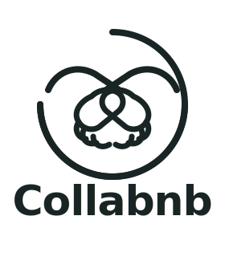

# Collabnb Waitlist Landing Site — Handoff Build Plan

> **Purpose of this doc.** This is a complete, drop-in brief for a fresh Claude session to build the Collabnb waitlist landing site from zero. Everything needed is here: decisions already locked, brand tokens, section-by-section specs, copy direction, form flows, Airtable schema, file structure, animation specs, and a starter HTML scaffold. Paste this entire file into the new session and say "build from this plan."
>
> **Reference site to mirror in structure and motion:** Fluence AI (fluence.framer.website). The new session should match Fluence's section cadence and liquid-glass vibe, but swap the pink-sunset-sky aesthetic for Collabnb's HAZY sage-and-mint palette.
>
> **Date of plan:** 2026-04-18. **App launch target:** 2026-06-01.

---

## 1. Project Snapshot

**What we're building:** A fully navigable multi-page marketing + waitlist site for Collabnb — a two-sided marketplace connecting content creators (UGC, micro-influencers, travel creators) with boutique hospitality hosts (boutique hotels, BnBs, glamping, small resorts, experiences, tourism boards).

**Primary goal of the site:** Capture waitlist signups, segmented by role (Creator vs Host), with a lifetime-access incentive for the first 100 on each side.

**Secondary goal:** Capture an optional beta-tester opt-in ahead of the 2026-06-01 app launch.

**What the site is NOT:** It is not the full Collabnb product. It is a landing site that will later be folded into the main site when the app ships. The onboarding/signup flows here ARE intentionally designed to also serve as the eventual app-side onboarding flows — so the schema and fields should match the app's user model.

---

## 2. Decisions Already Locked

| Decision | Answer |
|---|---|
| Deliverable format | Fully navigable multi-page site |
| Site structure | 5 pages: Home, About, How it Works, FAQ, Join |
| Waitlist backend | Airtable (user will set up the base themselves) |
| Airtable integration strategy | Embedded Airtable form inside a styled modal (zero backend, ships today) |
| Lifetime-access offer | First 100 creators AND first 100 hosts |
| Counter behavior at launch | Start from zero, real counts only |
| App launch date | 2026-06-01 (six weeks out, shown as live countdown) |
| Beta tester capture | Optional opt-in checkbox inside the main form (not a separate flow) |
| Creator/Host flows | Fully branched — different questions per role |
| Creator field depth | ~6 fields: name, email, TikTok+IG handles, portfolio URL, creator tier, past-3-month collab count |
| Host field depth | Essentials only (~4–5 fields); deeper audit happens later when they list a real stay |
| Verification model | Manual audit by Ben in Airtable — no auto-verify |
| Testimonials | Hide for MVP (no real users yet) |
| Sample collab cards | Placeholder/fictional stays with sample values; Ben is uploading his own card mockups to swap in |
| Floating card animation | Subtle bokeh-style floating background cards (not orbiting carousel) |
| Hero headline | "Where creators and boutique stays collab." |
| Logo | Placeholder slot in nav — Ben will drop in a logo file |
| Stack | Vanilla HTML + Tailwind CDN + vanilla JS (5 static HTML files) |
| Typography | Satoshi (body/UI) + Cabinet Grotesk (display/hero) — both served via Fontshare CDN |
| Background motif | HAZY palette sage/mint/off-white clouds — not pink sunset |

---

## 3. Brand Tokens (HAZY Theme)

### Palette

```css
:root {
  /* Brand surfaces */
  --ink:       #192524; /* Deep forest — primary text on light */
  --slate:     #3C5759; /* Teal slate — secondary text, borders on tint */
  --sage:      #959D90; /* Muted sage — tertiary text, muted accents */
  --mint:      #D1EBDB; /* Soft mint — accent surfaces, tag backgrounds */
  --stone:    #D0D5CE; /* Light gray sage — subtle dividers */
  --bone:     #EFECE9; /* Off-white — page background */

  /* Functional */
  --surface:   #FFFFFF;              /* pure white for glass cards */
  --surface-tint: rgba(255,255,255,0.55);
  --hairline:  rgba(25, 37, 36, 0.08);
  --hairline-strong: rgba(25, 37, 36, 0.14);

  /* Shadows — diffuse, tinted with --ink, never pure black */
  --shadow-sm: 0 1px 2px rgba(25,37,36,0.04), 0 2px 6px rgba(25,37,36,0.04);
  --shadow-md: 0 4px 16px rgba(25,37,36,0.06), 0 16px 32px rgba(25,37,36,0.04);
  --shadow-lg: 0 20px 40px -15px rgba(25,37,36,0.10);

  /* Glass inner highlight (use on all glass cards) */
  --glass-inner: inset 0 1px 0 rgba(255,255,255,0.6);
}
```

**Rules for color use (from the impeccable + soft + minimalist skills):**
- Never use pure `#000` or `#FFF` for text. Use `--ink` and `--bone`.
- Text on mint/stone/sage surfaces uses `--ink`, never a gray.
- `--ink` is the sole accent. Do not introduce purple, cyan, electric blue, or AI-gradient colors. 60/30/10 rule: 60% bone, 30% glass surfaces + stone/sage, 10% ink.
- No text-fill gradients. No `border-left: 4px solid accent` stripes. No neon glows.

### Typography

**Load both via Fontshare** (free, no key required):
```html
<link href="https://api.fontshare.com/v2/css?f[]=satoshi@400,500,700&f[]=cabinet-grotesk@400,500,700,800&display=swap" rel="stylesheet">
```

**Type scale (fluid with clamp):**
```css
:root {
  --font-display: "Cabinet Grotesk", ui-sans-serif, sans-serif;
  --font-body:    "Satoshi", ui-sans-serif, sans-serif;

  --fs-hero:  clamp(3rem, 7vw, 5.75rem);   /* display, tracking -0.03em, leading 0.95 */
  --fs-h2:    clamp(2.25rem, 4.5vw, 3.5rem);
  --fs-h3:    clamp(1.5rem, 2.2vw, 2rem);
  --fs-lead:  clamp(1.125rem, 1.5vw, 1.375rem); /* hero sub + section intros */
  --fs-body:  1rem;
  --fs-sm:    0.875rem;
  --fs-xs:    0.75rem;                   /* eyebrow tags */
}

body { font-family: var(--font-body); color: var(--ink); background: var(--bone); }
h1, h2, h3, .display { font-family: var(--font-display); letter-spacing: -0.025em; line-height: 1.02; }
h1 { font-weight: 700; }
```

**Hierarchy rule:** 1.25× minimum ratio between type steps. Body cap at 65–75ch.

### Spacing scale (4pt)
```
--space-2:  0.5rem;   --space-3: 0.75rem;  --space-4: 1rem;
--space-6:  1.5rem;   --space-8: 2rem;     --space-12: 3rem;
--space-16: 4rem;     --space-24: 6rem;    --space-32: 8rem;
```
Section vertical padding: `py-24` desktop, `py-16` mobile minimum. Section-to-section rhythm should breathe — this is a luxury travel brand feel, not a dense SaaS dashboard.

### Radius
- Glass cards / major containers: `1.75rem` (28px)
- Buttons / pills: fully rounded (`9999px`) for CTAs and eyebrow tags
- Form inputs: `0.75rem` (12px)
- Small badges: `0.5rem` (8px)

---

## 4. Liquid Glass System (The Signature Look)

Every card, the nav pill, the hero centerpiece, and the floating bokeh cards use the same glass recipe. Consistency here is what sells the aesthetic.

### The glass card recipe
```css
.glass {
  background: rgba(255, 255, 255, 0.55);
  backdrop-filter: blur(24px) saturate(140%);
  -webkit-backdrop-filter: blur(24px) saturate(140%);
  border: 1px solid rgba(255, 255, 255, 0.6);
  box-shadow:
    inset 0 1px 0 rgba(255, 255, 255, 0.6),     /* top inner highlight */
    inset 0 -1px 0 rgba(25, 37, 36, 0.04),      /* bottom inner shade */
    0 20px 40px -15px rgba(25, 37, 36, 0.10);   /* ambient diffusion */
  border-radius: 1.75rem;
}
```

**Performance rule (from skills):** Apply `backdrop-filter` only to fixed/sticky elements (nav pill, floating cards) and hero-bound glass containers that users won't scroll *through*. Never on scrollable long sections — kills mobile FPS.

### Floating bokeh cards (background decoration)
- 4–6 glass cards positioned `fixed` in the hero viewport
- Sizes vary: ~120–260px wide
- Subtle drift animation: `translateY` up/down with 18–30s duration, staggered delays
- Each has slight rotation (`-4deg` to `6deg`), opacity 0.35–0.6
- Content inside is a tiny faux collab card: a 1-line stay name, a pill tag ("Glamping · Utah"), a tiny avatar circle
- `pointer-events: none` so they never block clicks

---

## 5. Background Motif — The HAZY Sky

**Not** the Fluence pink-cloud sunset. Instead:

- Base: `var(--bone)` `#EFECE9`
- Soft radial gradient layer: `radial-gradient(ellipse 80% 60% at 50% 0%, #D1EBDB 0%, transparent 70%)` — gives a mint haze at the top
- Optional cloud image layer: a desaturated, warm-to-cool soft cloud photograph at 0.18 opacity, mixed with `mix-blend-mode: multiply`. Place in `/assets/bg-clouds-hazy.webp`.
- Ultra-subtle film grain overlay: fixed `pointer-events:none` layer with SVG noise at 3% opacity

**Placeholder cloud sources for development** (until Ben provides a branded image):
- `https://picsum.photos/seed/collabnb-sky/2400/1200` (desaturate in CSS: `filter: saturate(0.4) hue-rotate(-20deg) brightness(1.1)`)
- Or AI-generate via the canvas-design skill: "soft overhead cloudscape, sage-mint tones, warm off-white sky, luxury travel magazine aesthetic, no pink, no orange"

---

## 6. Site Structure — 5 Pages

```
/
├── index.html          → Home (hero + stats + feature grid + mini-about + CTA)
├── about.html          → About Collabnb (brand story, mission, target audiences)
├── how-it-works.html   → 3-step process for Creators, 3-step process for Hosts
├── faq.html            → Accordion FAQ + "still have a question?" contact block
├── join.html           → Dedicated waitlist page with role toggle + form wizard
├── assets/
│   ├── bg-clouds-hazy.webp
│   ├── favicon.svg
│   ├── logo-placeholder.svg
│   └── sample-collab-card-*.webp    (Ben uploads these later)
├── styles/
│   └── main.css        → all custom CSS (tokens, glass, animation keyframes)
└── scripts/
    └── main.js         → nav scroll behavior, modal wizard, counter animations
```

All pages share: floating glass nav at top, footer at bottom, cloud-haze background layer, film grain overlay layer.

---

## 7. Section-by-Section Map (Mirrors Fluence, Rebranded)

### 7.1 Floating Glass Nav (all pages)
- Floats 16px from viewport top, centered, `max-width: fit-content`, glass recipe, fully rounded pill
- Contents left→right: logo placeholder (28px square), "Collabnb" wordmark in Cabinet Grotesk Bold, then link group (Home, About, How it Works, FAQ), then a dark pill CTA "Join the Waitlist" (`bg: var(--ink)`, text: `var(--bone)`)
- Mobile: collapses to hamburger that morphs into X on open (rotate 45deg), opens full-screen glass overlay with staggered link reveal (`translate-y-12 opacity-0` → `0/1`, delay cascade 50ms)
- Sticky behavior: on scroll, nav gets slightly more opaque (`background: rgba(255,255,255,0.75)`) — transition over 300ms

### 7.2 Hero (Home only)
**Layout:** Left-aligned, NOT centered. Max content width ~640px on the left half.

- **Eyebrow pill tag:** `EARLY ACCESS · LAUNCHING JUNE 1` — Satoshi 500, uppercase, tracking 0.2em, 10px text, mint-tinted pill with soft border
- **H1:** "Where creators and boutique stays collab." — Cabinet Grotesk 800, `--fs-hero`, `--ink`, tracking -0.03em, leading 0.95
- **Subhead:** "Get free stays in exchange for content. Or fill your rooms with creators who'll tell your story. Collabnb is the collab marketplace for boutique hospitality." — Satoshi 400, `--fs-lead`, `--slate`, max-width 52ch
- **Two CTAs:**
  - Primary: dark pill "Join the Waitlist" → opens modal wizard
  - Secondary: glass pill "See how it works" → links to /how-it-works
- **Centerpiece glass card** (bottom of hero, Fluence-style): a mock Collabnb message thread showing a sample collab listing card. Contents:
  > "Hey, I'd love to host you at Moss & Pine Cabin for a 2-night stay — looking for 3 Reels + 1 TikTok."
  >
  > (mini listing card preview inside: "Moss & Pine Cabin · Catskills, NY · UGC Pro · 3 deliverables · 2-night stay")
  >
  > Below: faux input field with placeholder "Reply to the host…" and 3 chip suggestions: "Accept the collab · See more photos · Ask a question"

- **Floating 3D glass elements** (replace Fluence's pink cubes):
  - 1 frosted glass sphere (CSS `border-radius: 50%`, glass recipe, translucent mint tint) — top right, drifts
  - 1 soft-edged mint blob / glass pill card — bottom left, slow float
  - 2–3 bokeh glass cards with mini collab content (see §4)
  - Alternative: swap cubes for actual SVG low-poly glass icons — a house, a camera, a key — styled as frosted glass at 30% opacity

### 7.3 Live Counters (Home, below hero)
Two-column layout, glass card containing:
```
Creators signed up          Hosts signed up
    0 / 100                     0 / 100
```
- Giant numbers in Cabinet Grotesk 800, `--fs-h2`
- Labels in Satoshi 500 uppercase tracking 0.15em, `--slate`
- Thin progress ring or horizontal bar beneath each, fills from 0 as signups come in
- First 100 on each side = lifetime access — small caption under: "First 100 on each side → lifetime access at launch"
- **Implementation:** Counter source is a public Airtable view or a JSON endpoint fetched on page load. `fetch()` two counts, animate from 0 to the real value over 2000ms using `ease-out-quart`. Cache for 60s.

### 7.4 Feature Grid — "For Creators / For Hosts" (Home)
Bento-style asymmetric grid. Two big tiles side-by-side at top, three smaller tiles below.

**For Creators tile (wide, glass):**
- H3: "Collabs that feel like vacations"
- Body: "Browse boutique stays that match your tier and content style. Apply, negotiate, create."
- Small visual: placeholder image of a laptop showing the app feed
- Mini chip row: "UGC Beginner · UGC Pro · Micro · Influencer"

**For Hosts tile (wide, glass):**
- H3: "Fill rooms with storytellers, not just guests"
- Body: "Post a stay, set your deliverables, and watch verified creators apply. Trade rooms for reach."
- Small visual: placeholder of a stay listing card
- Mini chip row: "Boutique Hotel · BnB · Glamping · Small Resort · Experience · Tourism Board"

**Three smaller tiles below:**
1. "Matched by taste, not just numbers" — creator tiers × stay style
2. "Messaging built for collabs" — listing cards inline in chat (show mini listing card preview)
3. "Your next stay, a collab away" — discovery-driven mobile-first feed

### 7.5 How It Works (Home teaser + full on /how-it-works)
Mirrors Fluence's "Simple 3-Step Process" but split into two tracks:

**Creator track:**
1. Apply to the waitlist — tell us your handles, tier, and recent collab count
2. Get verified — manual review, first 100 get lifetime access
3. Start collabing — browse stays, apply, create, travel

**Host track:**
1. Sign up as a host — tell us about your property
2. List your first collab — set deliverables, stay value, dates
3. Get matched — review creator applications, approve, host

On /how-it-works, each step is a full glass card in a vertical stack with a number badge, an H3, body copy, and a small visual. Staggered scroll-entry animation (translateY 16px + opacity, 80ms cascade).

### 7.6 Wait, No Testimonials (MVP)
**Hide entirely.** Do not build this section. Replace with a single full-bleed quote placeholder: "Collabnb is for the kind of creator who'd rather earn in experiences, and the kind of host who'd rather fill rooms with storytellers." — attributed to "— The Collabnb team."

### 7.7 About (/about)
- Hero: "Collabnb is built for collabs, not ads" — large Cabinet Grotesk
- Three-paragraph story on origin/mission, set in a narrow column (max-width 60ch) with generous leading
- "Who it's for" split: two glass cards side by side — Creators | Hosts — each with a bulleted list of subcategories (UGC Beginner, UGC Pro, etc. / Boutique Hotel, BnB, etc.)
- Brand principles: 5 glass mini-cards in a row — Glass-first UI, Minimal friction, Discovery-driven, Creator-centric, Mobile-first
- Final CTA: same pair as hero

### 7.8 FAQ (/faq)
- Accordion list, no outer card boxes — just `border-bottom: 1px solid var(--hairline)` between each
- `+` / `–` toggle icons (Phosphor Light weight or hand-drawn SVG), never rotating chevrons
- Open state uses a `grid-template-rows: 0fr → 1fr` transition (not animating height directly)
- Suggested questions:
  1. What is Collabnb?
  2. How is this different from Airbnb or influencer platforms?
  3. Who's the "first 100" lifetime access for?
  4. I'm a small creator — can I still sign up?
  5. I run a boutique hotel / BnB — how do I host collabs?
  6. When does the app launch?
  7. Is there a cost to join?
  8. How are creators verified?
  9. Can I sign up as both a creator and a host?
  10. What kind of content do hosts typically want?
- Bottom "Still have a question?" block links to a mailto or a simple contact form

### 7.9 Join / Waitlist (/join) — THE MONEY PAGE
This page is dedicated to the signup flow. Built as a single view with the role toggle front-and-center.

**Above-the-fold:**
- H1: "Join the Collabnb waitlist"
- Sub: "Six weeks until launch. First 100 creators and first 100 hosts get lifetime access."
- Role toggle (segmented control, glass): `[ I'm a Creator ] [ I'm a Host ]` — defaulting to Creator
- Live mini-counter beside: "23 / 100 creators left" (or wherever real count is)

**Below the toggle:**
- A step indicator: `1 — 2 — 3 — 4` (creator) or `1 — 2 — 3` (host)
- A "Start" button that opens the modal wizard

**The Modal Wizard**
- Full-viewport glass overlay with one large centered glass card
- Smooth step transitions: clip-path reveal or translateX with blur mask
- Progress bar at top of the modal
- Each step shows ONE question at a time to reduce friction
- `Esc` closes with confirmation

**Creator flow (6 fields, 4 steps):**
1. Name + email
2. TikTok handle + Instagram handle (at least one required)
3. Portfolio URL (optional) + creator tier (UGC Beginner / UGC Pro / Micro / Influencer)
4. Past 3-month collab count + optional beta tester checkbox
5. Submit → success state

**Host flow (4–5 fields, 3 steps):**
1. Name + email + business name
2. Property type (Boutique Hotel / BnB / Glamping / Small Resort / Experience / Tourism Board) + location (city, region, country)
3. Optional beta tester checkbox
4. Submit → success state

**Submission:**
- Each form embeds a hidden Airtable form (or redirects to one on submit)
- On success, modal transitions to a state: big checkmark (Phosphor Check, not a spinning wheel), "You're on the list. Position #X." — pulls from the counter API if possible. Shows a "Share Collabnb" row with plain copy-to-clipboard and mailto links.

### 7.10 Footer (all pages)
- Glass card spanning content width, `py-16`
- Left: logo + "Manage collabs effortlessly. Built for creators and boutique stays."
- Middle columns: Use Links (Home, About, How it Works, FAQ), Company (Contact, Privacy)
- Right: tiny social icon row (Instagram, TikTok) + copyright
- Bottom strip with address placeholder and legal links
- "About Collabnb" one-line micro-copy near the bottom (as Ben requested in his original brief)

---

## 8. Airtable Schema (for Ben to set up)

**Base name:** `Collabnb Waitlist`

**Table 1: `Creators`**
| Field | Type | Notes |
|---|---|---|
| Name | Single line | Required |
| Email | Email | Required, unique |
| TikTok | URL or single line | Optional; must have at least one of TT/IG |
| Instagram | URL or single line | Optional |
| Portfolio URL | URL | Optional |
| Creator Tier | Single select | UGC Beginner / UGC Pro / Micro / Influencer |
| Collabs (last 3mo) | Number | 0–999 |
| Beta Tester? | Checkbox | |
| Submitted At | Created time | |
| Verified? | Checkbox | Manual — Ben marks after audit |
| Lifetime Access? | Formula / checkbox | Auto-flag for first 100 `Verified? = true`, sorted by Submitted At |
| Notes | Long text | Ben's audit notes |

**Table 2: `Hosts`**
| Field | Type | Notes |
|---|---|---|
| Name | Single line | Required |
| Email | Email | Required, unique |
| Business Name | Single line | Required |
| Property Type | Single select | Boutique Hotel / BnB / Glamping / Small Resort / Experience / Tourism Board |
| Location (City) | Single line | Required |
| Location (Region/Country) | Single line | Required |
| Beta Tester? | Checkbox | |
| Submitted At | Created time | |
| Verified? | Checkbox | Manual |
| Lifetime Access? | Formula / checkbox | Auto-flag for first 100 verified |
| Notes | Long text | |

**Public count endpoints for the counter:**
- Create an Airtable public view for each table filtered by `Verified? = true`
- Use Airtable's "Count records" aggregation, or expose via a published-view API
- Simpler: every 60s, an Airtable automation writes the counts into a small `Meta` table that the site fetches via a public read-only API token (safe to ship — read-only, no PII)

**Airtable form setup:**
- Create a branded form per table with exactly the fields listed above
- Hide "Verified?", "Lifetime Access?", and "Notes" from the public form
- Get the form URLs and embed them in the modal wizard as an `<iframe>` on the last step, OR use Airtable form prefill URLs (`?prefill_Name=…&prefill_Email=…`) to pass data collected through the styled wizard directly into the final submission step

---

## 9. Motion Specs

**Easing tokens:**
```css
--ease-out-quart: cubic-bezier(0.25, 1, 0.5, 1);
--ease-out-expo:  cubic-bezier(0.16, 1, 0.3, 1);
--ease-drawer:    cubic-bezier(0.32, 0.72, 0, 1);
```

**Never:** `ease-in`, `linear` (except for infinite drift loops), `ease-in-out` on entries.

**Default transition for hover/press:** `transition: transform 200ms var(--ease-out-quart), opacity 200ms var(--ease-out-quart);`

**Button press feedback:** `:active { transform: scale(0.97); }` — mandatory on every button.

**Entry animation (scroll into viewport):**
```css
.reveal { opacity: 0; transform: translateY(16px); filter: blur(4px); transition: all 700ms var(--ease-out-expo); }
.reveal.in { opacity: 1; transform: translateY(0); filter: blur(0); }
```
Triggered via `IntersectionObserver` (NEVER via scroll listener). Threshold 0.15, `once: true`.

**Staggered group entry:** 60–80ms cascade between siblings. Never all-at-once.

**Infinite drift (floating cards):**
```css
@keyframes drift {
  0%, 100% { transform: translateY(0) rotate(-2deg); }
  50%      { transform: translateY(-14px) rotate(2deg); }
}
.bokeh { animation: drift 22s var(--ease-drawer) infinite; }
```
Vary duration (18–30s) and delay per card so they never sync.

**Counter animation:** from 0 to value in 2000ms, `ease-out-quart`.

**Modal wizard step transitions:** 250ms, `ease-out-quart`. Old step exits with `translateX(-12px) + opacity 0 + blur(4px)`, new step enters opposite. Use `@starting-style` where supported.

**Reduced motion:** wrap all `translateY`, `translateX`, `scale` animations in `@media (prefers-reduced-motion: no-preference)`. Under `reduce`, keep only opacity transitions at 200ms.

---

## 10. Accessibility

- All interactive targets ≥ 44×44px
- Color contrast: `--ink` on `--bone` = 14.5:1 ✓. Test `--slate` on `--bone` (must be ≥ 4.5:1 for body) — if it fails, darken slate to `#2F4648`
- Every input has a visible label above (never placeholder-as-label)
- Modal wizard: focus-trap, `Esc` closes, focus returns to trigger on close
- Accordion FAQ: `aria-expanded`, `aria-controls`, keyboard operable with `Enter`/`Space`
- Skip-to-main-content link at top of each page
- All images have meaningful `alt` (decorative glass cubes get `alt=""` + `role="presentation"`)
- Respect `prefers-reduced-motion`
- Nav pill: when focused, show visible ring (`outline: 2px solid var(--ink); outline-offset: 2px`) — not removed

---

## 11. Responsive Breakpoints

- `sm`: 640px
- `md`: 768px
- `lg`: 1024px
- `xl`: 1280px

**Critical collapse rules:**
- Below 768px: nav pill collapses to hamburger + full-screen glass overlay
- Below 768px: all asymmetric grid layouts collapse to single column `grid-cols-1` with `gap-6`
- Hero floating cubes: hide decorative ones below 640px (keep only the hero centerpiece glass card)
- Use `min-h-[100dvh]` on hero, NEVER `h-screen` (iOS Safari bug)
- Horizontal padding: `px-4` mobile → `px-8` tablet → `max-w-7xl mx-auto` desktop

---

## 12. Copy Direction (Ben's voice — friendly, travel-forward, creator-first)

**Hero H1:** "Where creators and boutique stays collab."

**Hero sub:** "Get free stays in exchange for content. Or fill your rooms with creators who'll tell your story. Collabnb is the collab marketplace for boutique hospitality."

**Eyebrow tag:** "EARLY ACCESS · LAUNCHING JUNE 1"

**Section intros (short, sentence-case, no filler):**
- Feature grid: "Two sides, one marketplace."
- How it works: "From signup to first collab in three steps."
- Counter: "Lifetime access for the first 100 on each side."
- FAQ: "Things people ask."
- Final CTA: "Six weeks to launch. Save your spot."

**Banned words** (per skills): Elevate, Seamless, Unleash, Next-Gen, Game-changer, Delve. Plain specific language only.

**CTA microcopy:**
- Primary: "Join the Waitlist"
- Secondary: "See how it works"
- Success state: "You're on the list."

---

## 13. Starter HTML Scaffold (index.html)

This is the skeleton the next session should start from. Paste into `index.html`, then fill in remaining sections per §7.

```html
<!DOCTYPE html>
<html lang="en">
<head>
<meta charset="UTF-8" />
<meta name="viewport" content="width=device-width, initial-scale=1" />
<title>Collabnb — Where creators and boutique stays collab</title>
<meta name="description" content="The collab marketplace for creators and boutique stays. Join the waitlist — launching June 1, 2026." />

<link href="https://api.fontshare.com/v2/css?f[]=satoshi@400,500,700&f[]=cabinet-grotesk@400,500,700,800&display=swap" rel="stylesheet">
<script src="https://cdn.tailwindcss.com"></script>
<link rel="stylesheet" href="styles/main.css" />
</head>

<body class="bg-bone text-ink font-body antialiased overflow-x-hidden">

  <!-- Fixed background layers -->
  <div aria-hidden="true" class="fixed inset-0 -z-10 bg-bone"></div>
  <div aria-hidden="true" class="fixed inset-0 -z-10"
       style="background: radial-gradient(ellipse 90% 60% at 50% 0%, #D1EBDB 0%, transparent 70%);"></div>
  <div aria-hidden="true" class="fixed inset-0 -z-10 opacity-[0.18] mix-blend-multiply"
       style="background-image: url('assets/bg-clouds-hazy.webp'); background-size: cover; background-position: center;"></div>
  <div aria-hidden="true" class="fixed inset-0 pointer-events-none z-50 opacity-[0.03]"
       style="background-image: url('data:image/svg+xml;utf8,<svg xmlns=\'http://www.w3.org/2000/svg\' width=\'200\' height=\'200\'><filter id=\'n\'><feTurbulence baseFrequency=\'0.9\'/></filter><rect width=\'100%\' height=\'100%\' filter=\'url(%23n)\'/></svg>');"></div>

  <!-- Floating glass nav -->
  <nav class="fixed top-4 left-1/2 -translate-x-1/2 z-40 glass rounded-full px-3 py-2 flex items-center gap-6">
    <a href="/" class="flex items-center gap-2 pl-2">
      
      <span class="font-display font-bold text-lg tracking-tight">Collabnb</span>
    </a>
    <ul class="hidden md:flex items-center gap-5 text-sm">
      <li><a href="/" class="hover:opacity-70 transition-opacity">Home</a></li>
      <li><a href="/about.html" class="hover:opacity-70 transition-opacity">About</a></li>
      <li><a href="/how-it-works.html" class="hover:opacity-70 transition-opacity">How it works</a></li>
      <li><a href="/faq.html" class="hover:opacity-70 transition-opacity">FAQ</a></li>
    </ul>
    <a href="/join.html" class="btn-primary">Join the Waitlist</a>
  </nav>

  <!-- Hero -->
  <section class="relative min-h-[100dvh] flex items-center">
    <div class="max-w-7xl mx-auto px-4 md:px-8 w-full pt-32 pb-24">
      <div class="max-w-[640px]">
        <span class="eyebrow-tag">Early access · Launching June 1</span>
        <h1 class="mt-6 display text-[clamp(3rem,7vw,5.75rem)] font-extrabold leading-[0.95] tracking-tight">
          Where creators and boutique stays collab.
        </h1>
        <p class="mt-6 text-lg md:text-xl text-slate max-w-[52ch]">
          Get free stays in exchange for content. Or fill your rooms with creators who'll tell your story. Collabnb is the collab marketplace for boutique hospitality.
        </p>
        <div class="mt-10 flex flex-wrap gap-4">
          <a href="/join.html" class="btn-primary">Join the Waitlist</a>
          <a href="/how-it-works.html" class="btn-glass">See how it works</a>
        </div>
      </div>

      <!-- Hero centerpiece glass card (collab message preview) — positioned bottom-center -->
      <!-- TODO: build per §7.2 -->

      <!-- Floating bokeh cards (decorative) -->
      <div aria-hidden="true" class="bokeh-field absolute inset-0 pointer-events-none">
        <!-- TODO: 4–6 small glass cards positioned absolutely, each with drift animation -->
      </div>
    </div>
  </section>

  <!-- Live counters -->
  <section class="py-24"> <!-- TODO: build per §7.3 --> </section>

  <!-- Feature grid -->
  <section class="py-24"> <!-- TODO: build per §7.4 --> </section>

  <!-- How it works teaser -->
  <section class="py-24"> <!-- TODO: build per §7.5 --> </section>

  <!-- Final CTA -->
  <section class="py-32 text-center">
    <h2 class="display text-[clamp(2.25rem,4.5vw,3.5rem)] font-bold tracking-tight">Six weeks to launch.<br/>Save your spot.</h2>
    <div class="mt-10 flex justify-center gap-4">
      <a href="/join.html" class="btn-primary">Join the Waitlist</a>
      <a href="/how-it-works.html" class="btn-glass">See how it works</a>
    </div>
  </section>

  <!-- Footer -->
  <footer class="py-16"> <!-- TODO: build per §7.10 --> </footer>

  <script src="scripts/main.js"></script>
</body>
</html>
```

### Starter CSS (`styles/main.css`)

```css
/* --- TOKENS --- */
:root {
  --ink: #192524; --slate: #3C5759; --sage: #959D90;
  --mint: #D1EBDB; --stone: #D0D5CE; --bone: #EFECE9;
  --hairline: rgba(25,37,36,0.08);
  --ease-out-quart: cubic-bezier(0.25, 1, 0.5, 1);
  --ease-out-expo:  cubic-bezier(0.16, 1, 0.3, 1);
}
body { font-family: "Satoshi", ui-sans-serif, sans-serif; color: var(--ink); background: var(--bone); }
.font-body    { font-family: "Satoshi", ui-sans-serif, sans-serif; }
.font-display { font-family: "Cabinet Grotesk", ui-sans-serif, sans-serif; letter-spacing: -0.025em; line-height: 1.02; }
.display      { font-family: "Cabinet Grotesk", ui-sans-serif, sans-serif; letter-spacing: -0.03em; line-height: 0.95; }
.bg-bone  { background-color: var(--bone); }
.bg-mint  { background-color: var(--mint); }
.text-ink   { color: var(--ink); }
.text-slate { color: var(--slate); }
.text-sage  { color: var(--sage); }

/* --- GLASS --- */
.glass {
  background: rgba(255,255,255,0.55);
  backdrop-filter: blur(24px) saturate(140%);
  -webkit-backdrop-filter: blur(24px) saturate(140%);
  border: 1px solid rgba(255,255,255,0.6);
  box-shadow:
    inset 0 1px 0 rgba(255,255,255,0.6),
    inset 0 -1px 0 rgba(25,37,36,0.04),
    0 20px 40px -15px rgba(25,37,36,0.10);
}

/* --- BUTTONS --- */
.btn-primary {
  display: inline-flex; align-items: center; gap: 0.5rem;
  background: var(--ink); color: var(--bone);
  font-weight: 500; font-size: 0.95rem;
  padding: 0.85rem 1.5rem; border-radius: 9999px;
  transition: transform 200ms var(--ease-out-quart), background 200ms;
  box-shadow: inset 0 1px 0 rgba(255,255,255,0.12), 0 1px 2px rgba(25,37,36,0.2);
}
.btn-primary:hover  { background: #2a3a39; }
.btn-primary:active { transform: scale(0.97); }

.btn-glass {
  display: inline-flex; align-items: center; gap: 0.5rem;
  background: rgba(255,255,255,0.55);
  backdrop-filter: blur(16px) saturate(140%);
  color: var(--ink); font-weight: 500; font-size: 0.95rem;
  padding: 0.85rem 1.5rem; border-radius: 9999px;
  border: 1px solid rgba(255,255,255,0.6);
  box-shadow: inset 0 1px 0 rgba(255,255,255,0.6), 0 1px 2px rgba(25,37,36,0.04);
  transition: transform 200ms var(--ease-out-quart);
}
.btn-glass:hover  { background: rgba(255,255,255,0.75); }
.btn-glass:active { transform: scale(0.97); }

/* --- EYEBROW TAG --- */
.eyebrow-tag {
  display: inline-flex; align-items: center; gap: 0.4rem;
  background: rgba(209,235,219,0.7);
  border: 1px solid rgba(25,37,36,0.08);
  color: var(--ink);
  font-size: 0.7rem; font-weight: 500;
  padding: 0.35rem 0.75rem; border-radius: 9999px;
  text-transform: uppercase; letter-spacing: 0.2em;
}

/* --- REVEAL ON SCROLL --- */
.reveal {
  opacity: 0; transform: translateY(16px); filter: blur(4px);
  transition: opacity 700ms var(--ease-out-expo),
              transform 700ms var(--ease-out-expo),
              filter 700ms var(--ease-out-expo);
}
.reveal.in { opacity: 1; transform: translateY(0); filter: blur(0); }

/* --- BOKEH DRIFT --- */
@keyframes drift {
  0%, 100% { transform: translateY(0) rotate(-2deg); }
  50%      { transform: translateY(-14px) rotate(2deg); }
}
.bokeh { animation: drift 22s var(--ease-out-quart) infinite; }

/* --- REDUCED MOTION --- */
@media (prefers-reduced-motion: reduce) {
  .reveal, .bokeh { animation: none !important; transition: opacity 200ms; transform: none !important; filter: none !important; }
}
```

### Starter JS (`scripts/main.js`)

```js
// Reveal-on-scroll
const io = new IntersectionObserver((entries) => {
  entries.forEach((e) => { if (e.isIntersecting) { e.target.classList.add('in'); io.unobserve(e.target); } });
}, { threshold: 0.15 });
document.querySelectorAll('.reveal').forEach(el => io.observe(el));

// Nav opacity on scroll
const nav = document.querySelector('nav');
window.addEventListener('scroll', () => {
  if (window.scrollY > 40) nav.style.background = 'rgba(255,255,255,0.78)';
  else nav.style.background = 'rgba(255,255,255,0.55)';
}, { passive: true });

// Counter animation (fetch real Airtable counts, animate 0 → value)
async function animateCounters() {
  const COUNTER_URL = '/api/counts'; // Ben will set up — or fetch from Airtable public view
  try {
    const { creators, hosts } = await (await fetch(COUNTER_URL)).json();
    runCount('#count-creators', creators);
    runCount('#count-hosts', hosts);
  } catch { /* keep at 0 */ }
}
function runCount(sel, target) {
  const el = document.querySelector(sel);
  if (!el) return;
  const duration = 2000, start = performance.now();
  const step = (now) => {
    const t = Math.min(1, (now - start) / duration);
    const eased = 1 - Math.pow(1 - t, 4);
    el.textContent = Math.floor(eased * target);
    if (t < 1) requestAnimationFrame(step);
  };
  requestAnimationFrame(step);
}
animateCounters();

// Modal wizard — build per §7.9
// TODO: role toggle, step transitions, final Airtable form embed
```

---

## 14. Build Order for the Next Session

Do the work in this order. Each step is a checkpoint — render and sanity-check before moving on.

1. **Scaffold 5 pages** with shared nav + footer + background layers. All pages static, all linked from nav.
2. **Brand tokens in CSS** — paste §3 and §13 into `styles/main.css`. Verify fonts load.
3. **Hero on index.html** — copy, CTAs, centerpiece glass card, floating bokeh cards. This is the money shot — spend time here.
4. **Counters + feature grid + how-it-works teaser + final CTA on index.html**. Apply `.reveal` to every major block.
5. **About page** — hero + brand story + who-it's-for split + principles grid + CTA.
6. **How it Works page** — Creator track (3 steps) + Host track (3 steps), each step a big glass card.
7. **FAQ page** — accordion with `grid-template-rows` animation, 10 seeded questions, "still have a question?" block.
8. **Join page** — role toggle, step indicator, modal wizard with branched flows, Airtable form embed on final step, success state.
9. **Footer** — build once, include on all pages.
10. **Polish pass** — hover states on every interactive element, `scale(0.97)` on `:active`, focus rings, reduced-motion media query, keyboard nav on modal.
11. **Mobile pass** — test every page at 375px. Nav → hamburger. Asymmetric grids → single column. Hide decorative bokeh on small screens.
12. **Lighthouse pass** — target 95+ on Performance, 100 on Accessibility, 100 on Best Practices. Compress WebP cloud bg to < 120KB.

---

## 15. Open Items for Ben (do not block build)

- Drop final logo SVG into `assets/logo-placeholder.svg`
- Drop HAZY-themed cloud background into `assets/bg-clouds-hazy.webp` (or let the session AI-generate one)
- Provide sample collab card images to swap in for bokeh content
- Create the Airtable base with the schema in §8
- Get Airtable form embed URLs (one per table) and provide to the session for §7.9
- Decide on a real domain (e.g., `collabnb.com`, `getcollabnb.com`, or a `collabnb.framer.website`-style placeholder) and point it at the deploy target (Netlify, Vercel, or GitHub Pages — all fine for static HTML)

---

## 16. Anti-Patterns to Avoid (from loaded skills)

- No `border-left: 4px solid var(--accent)` stripe accents on cards (#1 AI tell)
- No `background-clip: text` gradient text
- No pure `#000` or `#FFF` anywhere — always `--ink` and `--bone`
- No Inter, Roboto, Arial, Open Sans — Satoshi + Cabinet Grotesk only
- No Lucide/Feather/FontAwesome — Phosphor Light or bespoke SVG only
- No `shadow-md`/`shadow-lg` — use the tinted diffusion shadows in §3
- No purple/cyan accents, no AI gradients
- No testimonial section with fake names
- No centered hero — left-aligned with max-width
- No `h-screen` — `min-h-[100dvh]`
- No animation on keyboard-triggered actions
- No `ease-in` or default `ease-in-out` on UI entries
- No `width`/`height` animations — transform + opacity only
- No `backdrop-filter` on scrolling containers
- Never attach grain/noise to scrolling elements — `fixed` only
- No emojis in code or copy
- No filler words (Elevate, Seamless, Unleash, Next-Gen, Game-changer, Delve)

---

## 17. Receiving Session — Your Opening Move

When a fresh session picks this up, it should:

1. Read this plan in full.
2. Check for `assets/bg-clouds-hazy.webp` and `assets/logo-placeholder.svg`. If missing, use a `picsum.photos` placeholder desaturated in CSS, and a simple SVG circle for the logo.
3. Scaffold the 5-page structure with shared nav/footer and drop the tokens CSS in.
4. Build the hero in full before anything else. Render it and confirm the feel matches the Fluence reference but in HAZY colors.
5. Proceed through §14 build order.
6. Every ~25% of progress: render the page(s) and sanity-check for AI-slop tells from §16.

Nothing else about the user's context, app state, or prior conversations is needed — everything required is in this document.

---

*End of plan. Ready to hand off.*
